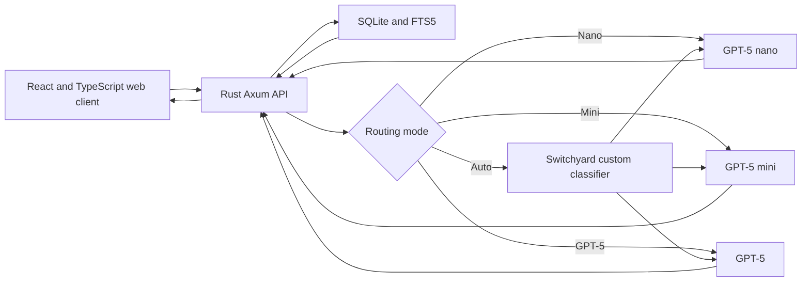

# Rules Router: Project Implementation Plan

## 1. Project Summary

Rules Router is an open-source web application for Dungeon Masters using the 2014 fifth-edition rules. It will answer rules questions during live games, search user-provided campaign notes, cite supporting sources, and demonstrate cost-aware routing across three OpenAI models through NVIDIA NeMo Switchyard.

The project is a one-week experimental MVP rather than a production service. Its central demonstration is that inexpensive models can handle straightforward, well-grounded questions while more capable models are reserved for questions that require synthesis or difficult adjudication.

## 2. Goals

### Primary goals

- Provide fast answers to D&D 5e 2014 rules questions.
- Ground rules answers in the System Reference Document 5.1.
- Cite the specific SRD or campaign-note sections used in an answer.
- Route requests among `gpt-5-nano`, `gpt-5-mini`, and `gpt-5`.
- Let the user override automatic routing.
- Make routing decisions, latency, token usage, and estimated cost visible.
- Demonstrate cost savings relative to sending every request to GPT-5.
- Keep expected API spending within a $20 monthly experiment budget.
- Keep Switchyard replaceable because it is experimental software.

### Secondary goals

- Support Markdown and plain-text campaign notes.
- Distinguish sourced rules from interpretations and table-specific material.
- Create a small evaluation suite for routing and answer quality.
- Make local setup straightforward for open-source contributors.

## 3. Non-Goals for the MVP

- Supporting rules editions other than 2014 fifth edition.
- Indexing copyrighted rulebooks beyond SRD 5.1.
- Reproducing all content available through D&D Beyond.
- User accounts, multi-user permissions, or cloud synchronization.
- Production hosting, high availability, or horizontal scaling.
- Native mobile applications.
- Voice input or audio output.
- Encounter generation, campaign generation, or autonomous DM features.
- Vector search unless evaluation shows that full-text search is inadequate.
- Multiple model providers.
- Fine-tuning models.

## 4. Users and Core Experience

### Primary user

A Dungeon Master who needs a quick, source-grounded answer while running a game.

### Primary workflow

1. The DM enters a rules question.
2. The application searches SRD 5.1 and available campaign notes.
3. The user-selected routing mode is applied.
4. In Auto mode, Switchyard selects nano, mini, or GPT-5.
5. The selected model answers using the retrieved passages.
6. The interface displays the answer, citations, model, routing explanation, latency, token usage, and estimated cost.
7. The interaction is added to a local activity log and cost summary.

### Model controls

- **Auto:** classify and route automatically.
- **Nano:** force `gpt-5-nano`.
- **Mini:** force `gpt-5-mini`.
- **GPT-5:** force `gpt-5`.

Manual selection bypasses the classifier so that the user does not pay for an unnecessary classification call.

## 5. Rules Content and Licensing

The application will use System Reference Document 5.1, which represents the 2014 fifth-edition rules and is available under Creative Commons Attribution 4.0.

Implementation requirements:

- Include the required SRD attribution in the repository and application.
- Include a copy or link to the CC BY 4.0 license.
- Preserve source metadata during ingestion.
- Do not include material from commercial books unless it is also present in SRD 5.1.
- Clearly state when the indexed SRD does not contain enough information to answer a question.
- Avoid implying that the application contains the complete D&D rules.
- Keep campaign notes logically separate from official SRD content.

## 6. Technical Architecture



### Components

#### Web client

- React with TypeScript.
- Vite development and build tooling.
- Streaming chat interface.
- Model-selection control.
- Citation display.
- Routing receipt for each answer.
- Local activity and cost dashboard.
- Campaign-note upload and management interface.

#### Rust API server

- Axum HTTP framework.
- Tokio asynchronous runtime.
- SQLx for SQLite access and migrations.
- Server-sent events or streaming HTTP responses.
- SRD and note retrieval.
- Prompt assembly and context limits.
- Switchyard proxy integration.
- Usage accounting and cost estimation.
- Input validation and error handling.

#### Switchyard

- Runs as a separate local process.
- Exposes an OpenAI-compatible endpoint to the Rust API.
- Defines passthrough routes for manual selection.
- Defines a custom three-target classifier for Auto mode.
- Uses `gpt-5-nano` as the classifier.
- Routes to nano, mini, or GPT-5.
- Defaults to mini if the classification result is invalid.

#### SQLite

- Stores normalized source documents and chunks.
- Uses FTS5 for rules and campaign-note search.
- Stores conversations, responses, routing events, usage, latency, and estimated costs.
- Requires no external database service.

## 7. Repository Structure

```text
rules-router/
├── README.md
├── LICENSE
├── NOTICE.md
├── .env.example
├── .gitignore
├── Cargo.toml
├── package.json
├── apps/
│   ├── api/
│   │   ├── Cargo.toml
│   │   ├── migrations/
│   │   ├── src/
│   │   └── tests/
│   └── web/
│       ├── package.json
│       ├── src/
│       └── tests/
├── crates/
│   ├── retrieval/
│   ├── routing/
│   └── domain/
├── config/
│   └── switchyard.toml
├── data/
│   ├── README.md
│   └── generated/
├── scripts/
│   └── ingest-srd/
├── evals/
│   ├── questions.jsonl
│   └── README.md
└── docs/
    ├── architecture.md
    ├── attribution.md
    └── demo-script.md
```

The exact structure may be simplified during implementation when separate crates do not yet justify their maintenance cost.

## 8. Data Model

### `documents`

- `id`
- `kind`: `srd` or `campaign_note`
- `title`
- `filename`
- `edition`
- `license`
- `checksum`
- `created_at`
- `updated_at`

### `source_chunks`

- `id`
- `document_id`
- `section_path`
- `heading`
- `content`
- `ordinal`
- `source_locator`
- FTS5-indexed searchable text

### `conversations`

- `id`
- `title`
- `created_at`
- `updated_at`

### `messages`

- `id`
- `conversation_id`
- `role`
- `content`
- `created_at`

### `model_runs`

- `id`
- `conversation_id`
- `message_id`
- `routing_mode`
- `selected_model`
- `selection_reason`
- `classifier_confidence`
- `input_tokens`
- `output_tokens`
- `estimated_cost_usd`
- `latency_ms`
- `status`
- `created_at`

### `run_sources`

- `model_run_id`
- `source_chunk_id`
- `retrieval_rank`
- `retrieval_score`

## 9. Retrieval Design

### Initial approach

SQLite FTS5 will be used for both SRD rules and campaign notes.

### Ingestion pipeline

1. Read the source document.
2. Normalize whitespace while preserving headings and source location.
3. Split content primarily on headings and paragraphs.
4. Merge fragments that are too short.
5. Split sections that exceed the context-size target.
6. Store document and chunk metadata.
7. Populate the FTS5 index.
8. Validate expected sections and chunk counts.

### Query pipeline

1. Normalize the user question.
2. Extract useful terms while preserving exact game terminology.
3. Search SRD chunks and campaign-note chunks separately.
4. Rank results using FTS5 relevance.
5. Apply source-type and score thresholds.
6. Deduplicate overlapping chunks.
7. Select a small context set within a fixed token budget.
8. Attach stable citation identifiers to each passage.

### Retrieval response structure

```json
{
  "query": "Can I stand while grappled?",
  "sources": [
    {
      "citation_id": "S1",
      "kind": "srd",
      "title": "System Reference Document 5.1",
      "section": "Conditions > Grappled",
      "content": "...",
      "score": 0.92
    }
  ]
}
```

### Vector-search decision gate

Vector search will be deferred. It will be added only if the evaluation set shows repeated retrieval failures caused by semantic paraphrasing that FTS5 cannot resolve. If needed later, embeddings will augment rather than immediately replace full-text search.

## 10. Answering and Citation Policy

The answering prompt will require the model to rely on supplied sources and distinguish four kinds of statements:

- **Rule:** directly supported by an SRD passage.
- **Campaign note:** directly supported by an uploaded note.
- **Interpretation:** a reasoned ruling not settled explicitly by the supplied text.
- **Not found in SRD:** the indexed sources do not contain the necessary rule.

Each claim that depends on retrieved content should reference a supplied citation identifier such as `[S1]`. The server will validate that cited identifiers exist in the retrieved context before rendering them as source links.

The model must not invent citations. Unsupported citation identifiers will be omitted or surfaced as validation errors during development.

## 11. Routing Design

### Model tiers

| Route | Model | Intended use |
|---|---|---|
| `nano` | `gpt-5-nano` | Classification, direct lookup, extraction, short grounded answers |
| `mini` | `gpt-5-mini` | Multi-source explanation, moderate synthesis, ordinary adjudication |
| `full` | `gpt-5` | Ambiguous interactions, difficult reasoning, multiple defensible rulings |

### Automatic classifier

The classifier will run on `gpt-5-nano` and return structured output similar to:

```json
{
  "decision": {
    "target": "mini",
    "task_type": "rules_synthesis",
    "reason": "The question requires combining multiple retrieved rules.",
    "confidence": 0.87
  }
}
```

### Routing rubric

Route to nano when:

- One retrieved passage directly answers the question.
- The request is a definition or straightforward lookup.
- The task is extraction, formatting, or concise summarization.
- Little or no reconciliation among sources is required.

Route to mini when:

- The answer requires combining multiple passages.
- A rule needs explanation in context.
- Official rules and campaign notes need reconciliation.
- The question asks for a common adjudication with limited ambiguity.

Route to GPT-5 when:

- Relevant rules conflict or remain materially ambiguous.
- The user requests multiple defensible rulings and their consequences.
- The question contains a complex chain of interacting conditions or timing rules.
- Incorrect synthesis would materially mislead the DM despite adequate retrieval.

### Fallback behavior

- Invalid classifier output defaults to mini.
- Classifier failure defaults to mini and records the failure.
- Upstream model failure produces a visible retry option.
- Automatic retries will not silently escalate to GPT-5.
- A user may manually retry with a different model.

### Router abstraction

The Rust backend will depend on an internal `ModelRouter` interface rather than Switchyard-specific types. This keeps the proxy replaceable.

Conceptual interface:

```rust
#[async_trait]
pub trait ModelRouter {
    async fn complete(
        &self,
        request: RoutedCompletionRequest,
    ) -> Result<RoutedCompletionStream, RouterError>;
}
```

## 12. API Design

### Health and configuration

- `GET /api/health`
- `GET /api/config/public`
- `GET /api/models`

### Chat

- `POST /api/chat`
  - Accepts question, conversation ID, routing mode, and source filters.
  - Returns a streamed answer and final routing metadata.
- `GET /api/conversations/:id`
- `GET /api/conversations/:id/messages`

### Search and sources

- `GET /api/search?q=...`
- `GET /api/sources/:chunk_id`

### Campaign notes

- `POST /api/notes`
- `GET /api/notes`
- `GET /api/notes/:id`
- `DELETE /api/notes/:id`

Deletion will require explicit confirmation in the interface.

### Activity and cost

- `GET /api/activity`
- `GET /api/usage/summary`
- `GET /api/usage/daily`

## 13. Frontend Plan

### Main chat view

- Question input optimized for rapid use.
- Auto/Nano/Mini/GPT-5 segmented control.
- Streaming answer display.
- Clear loading, retrieval, routing, and generation states.
- Citation markers that open source details.
- Copy-answer action.
- Retry using another model.

### Routing receipt

Displayed below each answer:

- Selected model.
- Automatic or manual selection.
- Short routing reason.
- Classifier confidence when applicable.
- Input and output token counts.
- Estimated request cost.
- End-to-end latency.

### Source panel

- Source type: SRD or campaign note.
- Document title.
- Section path.
- Supporting excerpt.
- Retrieval rank or score in a development-only view.

### Campaign-note management

- Upload Markdown or plain text.
- List indexed notes.
- Show document metadata and chunk count.
- Delete a note with confirmation.
- Report unsupported formats and ingestion failures clearly.

### Usage dashboard

- Total questions.
- Requests by selected model.
- Actual estimated spend.
- Estimated spend if every request used GPT-5.
- Estimated savings amount and percentage.
- Average latency by model.
- Automatic versus manual routing counts.

## 14. Cost Controls

- Use nano for classification.
- Skip classification for manual routes.
- Limit retrieved chunks and total context size.
- Cap maximum generated tokens per route.
- Avoid resending unnecessary conversation history.
- Cache deterministic retrieval results.
- Optionally cache exact repeated questions with matching source versions.
- Store current per-model pricing in configuration rather than hard-coding it throughout the application.
- Record the pricing version or update timestamp used for each estimate.
- Add configurable warning and hard-stop thresholds.
- Default warning threshold: $15 in the current calendar month.
- Default experimental hard stop: $20 in the current calendar month.
- Require an explicit local configuration change to raise the hard stop.

Cost estimates are informational and may differ slightly from provider billing.

## 15. Security and Privacy

- Read the OpenAI credential from `OPENAI_API_KEY`.
- Never send the API key to the browser.
- Never write the API key to application logs or the database.
- Provide `.env.example` without real credentials.
- Ignore local environment files in Git.
- Validate upload type and size.
- Store uploaded notes locally for the MVP.
- Inform users that retrieved campaign-note passages are sent to the selected OpenAI model.
- Escape rendered Markdown and source content to prevent script injection.
- Bind local services to loopback by default.
- Avoid logging full prompts unless an explicit development flag is enabled.

## 16. Observability

Each model request will record:

- Request and conversation identifiers.
- Route mode.
- Selected model.
- Routing reason and confidence.
- Retrieval source identifiers.
- Retrieval duration.
- Classifier duration.
- Generation duration.
- Total latency.
- Input and output tokens.
- Estimated cost.
- Completion status and normalized error category.

Sensitive prompt and note content will not be included in ordinary structured logs.

## 17. Testing Strategy

### Rust unit tests

- Query normalization.
- Chunking behavior.
- FTS query construction.
- Citation parsing and validation.
- Cost calculations.
- Route-mode parsing.
- Prompt context limits.
- Error normalization.

### Rust integration tests

- Database migrations.
- SRD ingestion into a temporary database.
- Search result ranking.
- Note upload, search, and deletion.
- Chat endpoint with a mocked router.
- Streaming response format.
- Usage aggregation.

### Frontend tests

- Model selector behavior.
- Streaming answer rendering.
- Citation interaction.
- Routing receipt display.
- Upload validation.
- Dashboard calculations.

### Switchyard smoke tests

- Each passthrough route reaches the expected model.
- Auto mode produces a valid three-way choice.
- Invalid classifier output falls back to mini.
- Manual selection bypasses classification.
- Streaming remains intact through the proxy.

### Evaluation set

Create 30–50 representative questions divided among:

- Direct definitions.
- Single-rule lookups.
- Multi-rule synthesis.
- Ambiguous interactions.
- Questions not answered by the SRD.
- Campaign-specific questions.
- Adversarial requests to ignore sources or fabricate citations.

Score each example for:

- Retrieval relevance.
- Route appropriateness.
- Factual grounding.
- Citation correctness.
- Appropriate uncertainty.
- Latency.
- Estimated cost.

## 18. Success Criteria

The MVP is successful when it can demonstrate all of the following:

1. A direct rules question is answered by nano with a valid SRD citation.
2. A multi-rule question is automatically routed to mini.
3. A difficult or ambiguous interaction is automatically routed to GPT-5.
4. The user can force any of the three models.
5. A campaign-note question is answered with a note citation.
6. The application states when the SRD does not contain sufficient information.
7. Every completed request displays route, model, latency, usage, and estimated cost.
8. The dashboard compares routed cost with an always-GPT-5 baseline.
9. The application stops new model calls at the configured monthly hard limit.
10. A new contributor can run the project using documented local setup steps.

## 19. One-Week Implementation Schedule

### Day 1: Repository and model connectivity

- Create the monorepo structure.
- Add MIT license, README, environment template, and contribution basics.
- Scaffold the Rust Axum API.
- Scaffold the React/TypeScript client.
- Add SQLite and migrations.
- Configure Switchyard with three OpenAI targets.
- Confirm manual calls and streaming for nano, mini, and GPT-5.
- Implement the internal router abstraction.

**Deliverable:** A web page can send a test prompt through a manually selected model.

### Day 2: SRD ingestion and search

- Add SRD 5.1 attribution and source documentation.
- Build the SRD parser and chunker.
- Store source hierarchy and stable locators.
- Populate the SQLite FTS5 index.
- Implement search endpoints.
- Add retrieval unit and integration tests.

**Deliverable:** A query returns ranked SRD passages with source metadata.

### Day 3: Grounded chat and citations

- Build prompt assembly.
- Enforce context and output limits.
- Implement answer streaming.
- Add citation identifiers and server-side validation.
- Render citations and source excerpts in the client.
- Add insufficient-evidence behavior.

**Deliverable:** A manually routed model answers from retrieved SRD passages with citations.

### Day 4: Automatic three-tier routing

- Implement the nano classifier schema and prompt.
- Configure Switchyard custom target selection.
- Add Auto mode.
- Implement default-to-mini failure behavior.
- Capture selected model, reason, confidence, latency, and tokens.
- Add routing receipt UI.

**Deliverable:** Auto mode visibly routes representative questions across all three models.

### Day 5: Campaign notes

- Implement Markdown and text upload.
- Parse, chunk, and index campaign notes.
- Add note listing and deletion.
- Search SRD and notes separately before merging results.
- Label source types in prompts and citations.
- Document privacy behavior.

**Deliverable:** The app answers a campaign-specific question using an uploaded note.

### Day 6: Cost controls and evaluation

- Implement configurable model prices.
- Calculate actual and always-GPT-5 estimates.
- Add warning and hard-stop thresholds.
- Build the activity and usage endpoints.
- Create the initial evaluation dataset.
- Run route, retrieval, grounding, latency, and cost evaluations.
- Tune classifier instructions and thresholds.

**Deliverable:** A dashboard shows usage, cost, model distribution, and estimated savings.

### Day 7: Reliability and demonstration polish

- Fix evaluation failures and usability issues.
- Test the main workflow end to end.
- Improve loading and error states.
- Complete local setup instructions.
- Document architecture and known limitations.
- Write and rehearse the demonstration script.
- Confirm no secrets or unlicensed content are committed.

**Deliverable:** A reproducible local MVP ready for a short live demonstration.

## 20. Demonstration Script

1. Open the application and show the $20 cost cap.
2. Ask a direct question such as, “What does the prone condition do?”
3. Show that Auto chose nano and cited the relevant SRD section.
4. Ask a question requiring multiple rules and show mini being selected.
5. Ask an intentionally ambiguous interaction and show GPT-5 being selected.
6. Repeat one question with a manual model choice.
7. Upload a short campaign note.
8. Ask a campaign-specific question and open its citation.
9. Open the dashboard and compare routed cost with the always-GPT-5 baseline.
10. Explain that the application code is insulated from Switchyard by the router interface.

## 21. Risks and Mitigations

### Switchyard changes or instability

**Risk:** Switchyard is pre-alpha and may change during development.

**Mitigation:** Isolate it behind a Rust `ModelRouter` interface and keep its configuration separate from domain logic.

### Classifier cost or poor routing

**Risk:** Classification adds cost and can choose an unsuitable tier.

**Mitigation:** Use nano, skip classification for manual choices, retain routing metadata, provide manual retry, and tune against an evaluation set.

### Weak retrieval

**Risk:** FTS5 may miss paraphrased questions.

**Mitigation:** Normalize queries, preserve D&D terminology, test representative questions, and add hybrid vector retrieval only if measured failures justify it.

### Hallucinated rules or citations

**Risk:** A model may invent rules or cite unavailable material.

**Mitigation:** Constrain answers to retrieved passages, validate citation identifiers, distinguish interpretation, and provide explicit insufficient-evidence behavior.

### Edition confusion

**Risk:** The model may mix revised 2024 rules into a 2014 answer.

**Mitigation:** State the edition in system instructions, retrieve only SRD 5.1, label the edition in the interface, and include edition-confusion cases in evaluation.

### Accidental cost growth

**Risk:** Large histories, contexts, or retries could exceed the budget.

**Mitigation:** Apply strict context and output caps, avoid automatic escalation retries, log usage, and enforce a local monthly hard stop.

### Copyright scope

**Risk:** Users may assume the app can ingest or reproduce all commercial D&D books.

**Mitigation:** Ship only SRD 5.1, include attribution, document the content boundary, and treat user-uploaded notes as private user-provided data.

## 22. Future Work

After the MVP is demonstrated and evaluated:

- Hybrid full-text and vector retrieval.
- Support for SRD 5.2.1 as a separate selectable edition.
- Encounter-design routing.
- Persistent campaigns and richer campaign memory.
- PDF and DOCX note ingestion.
- Additional model providers.
- Self-hosted models.
- Authentication and multi-user campaign spaces.
- Cloud deployment.
- User feedback on answers and route choices.
- Automated prompt and router evaluation in CI.
- Route optimization based on measured quality, latency, and cost.
- Optional voice interface for hands-free use during games.

## 23. Required Inputs During Implementation

- An OpenAI API key supplied locally through `OPENAI_API_KEY` when live API testing begins.
- One or two non-sensitive Markdown or plain-text campaign-note samples for upload testing.

The API key must never be pasted into project documentation or committed to version control.

## 24. Final Deliverables

- Open-source repository licensed under MIT.
- React/TypeScript web application.
- Rust/Axum backend.
- SQLite schema and migrations.
- SRD 5.1 ingestion and FTS5 retrieval.
- Campaign-note ingestion and retrieval.
- Switchyard configuration for three-tier OpenAI routing.
- Auto and manual model selection.
- Streaming grounded answers with citations.
- Routing receipts and usage dashboard.
- Cost warning and hard-stop controls.
- Automated tests and evaluation dataset.
- Setup, architecture, attribution, limitations, and demo documentation.

